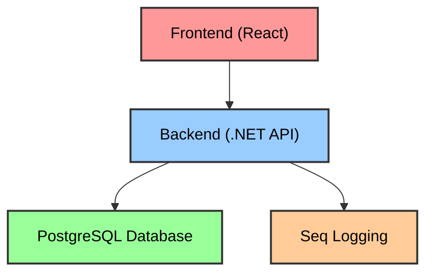

# Docker Setup and Containerization Guide

This document provides detailed information about the Docker setup for the Ice Cream Recipes application.

## Architecture Overview

The Ice Cream Recipes application is containerized using Docker with multiple services that work together:



## Docker Components

### Main docker-compose.yml

The root `docker-compose.yml` file orchestrates all services:

```yaml
services:
  frontend:
    build:
      context: ./frontend
      dockerfile: Dockerfile
    ports:
      - '3000:80'
    depends_on:
      - backend
    networks:
      - ice-cream-network

  backend:
    build:
      context: ./backend
      dockerfile: Dockerfile
    ports:
      - '5000:8080'
    environment:
      - ASPNETCORE_ENVIRONMENT=Development
      - ConnectionStrings__DefaultConnection=Host=postgres;Database=ice_cream_recipes;Username=icecream;Password=icecream_pass
      - Serilog__WriteTo__1__Args__serverUrl=http://seq:5341
    depends_on:
      - postgres
      - seq
    networks:
      - ice-cream-network

  postgres:
    image: postgres:15
    environment:
      POSTGRES_USER: icecream
      POSTGRES_PASSWORD: icecream_pass
      POSTGRES_DB: ice_cream_recipes
    ports:
      - '5432:5432'
    volumes:
      - postgres_data:/var/lib/postgresql/data
      - ./backend/Database/InitialSchema.sql:/docker-entrypoint-initdb.d/init.sql
    networks:
      - ice-cream-network

  seq:
    image: datalust/seq:latest
    environment:
      ACCEPT_EULA: Y
    ports:
      - '5341:80'
    volumes:
      - seq_data:/data
    networks:
      - ice-cream-network

networks:
  ice-cream-network:
    driver: bridge

volumes:
  postgres_data:
  seq_data:
```

### Backend Dockerfile

The backend Dockerfile builds the .NET API:

```dockerfile
FROM mcr.microsoft.com/dotnet/sdk:8.0 AS build
WORKDIR /src

# Copy csproj and restore dependencies
COPY IceCreamRecipes.sln ./
COPY src/IceCreamRecipes.API/*.csproj ./src/IceCreamRecipes.API/
COPY tests/IceCreamRecipes.Tests/*.csproj ./tests/IceCreamRecipes.Tests/
RUN dotnet restore

# Copy all files and build
COPY . .
RUN dotnet build -c Release -o /app/build

# Publish the application
FROM build AS publish
RUN dotnet publish src/IceCreamRecipes.API/IceCreamRecipes.API.csproj -c Release -o /app/publish

# Build runtime image
FROM mcr.microsoft.com/dotnet/aspnet:8.0 AS final
WORKDIR /app
COPY --from=publish /app/publish .
EXPOSE 8080
ENTRYPOINT ["dotnet", "IceCreamRecipes.API.dll"]
```

### Frontend Dockerfile

The frontend Dockerfile builds the React app and serves it via Nginx:

```dockerfile
# Build stage
FROM node:20-alpine AS build
WORKDIR /app

# Install dependencies
COPY package.json yarn.lock ./
RUN yarn install

# Build the application
COPY . .
RUN yarn build

# Production stage
FROM nginx:alpine AS final
COPY --from=build /app/dist /usr/share/nginx/html
COPY nginx.conf /etc/nginx/conf.d/default.conf
EXPOSE 80
CMD ["nginx", "-g", "daemon off;"]
```

## Local Development with Docker

### Prerequisites

- Docker Desktop installed and running
- Docker Compose installed

### Starting the Full Stack

To start all services together:

```bash
docker-compose up -d
```

This will build and start:

- The React frontend on http://localhost:3000
- The .NET API backend on http://localhost:5000
- PostgreSQL database on port 5432
- Seq logging server on http://localhost:5341

### Starting Individual Services

For more granular control, you can start only specific services:

```bash
# Start only database and logging
docker-compose up -d postgres seq

# Start only backend components
docker-compose up -d backend postgres seq

# Start only frontend (requires backend to be running for full functionality)
docker-compose up -d frontend
```

## Volume Management

The Docker setup uses two persistent volumes:

1. `postgres_data`: Stores the PostgreSQL database files
2. `seq_data`: Stores Seq log data

These volumes persist data between container restarts, ensuring you won't lose your recipes or logs.

To remove volumes and start fresh (⚠️ will delete all data):

```bash
docker-compose down -v
```

## Network Configuration

All services connect to the `ice-cream-network` bridge network, which allows:

- Services to communicate using their service names as hostnames
- Isolation from other Docker networks on your system

## Environment Variables

### Backend Environment Variables

| Variable                               | Description                                            |
| -------------------------------------- | ------------------------------------------------------ |
| `ASPNETCORE_ENVIRONMENT`               | Runtime environment (Development, Staging, Production) |
| `ConnectionStrings__DefaultConnection` | PostgreSQL connection string                           |
| `Serilog__WriteTo__1__Args__serverUrl` | Seq server URL for logging                             |

### Database Environment Variables

| Variable            | Description       |
| ------------------- | ----------------- |
| `POSTGRES_USER`     | Database user     |
| `POSTGRES_PASSWORD` | Database password |
| `POSTGRES_DB`       | Database name     |

## Production Deployment Considerations

For production deployment:

1. **Environment Variables**: Replace development values with production-appropriate settings

2. **Secrets Management**: Consider using Docker secrets or environment files instead of hardcoding secrets

3. **SSL**: Configure SSL certificates for frontend and backend services

4. **Database Backups**: Implement regular backups of the PostgreSQL volume

5. **Resource Limits**: Add resource constraints to containers:

   ```yaml
   services:
     backend:
       deploy:
         resources:
           limits:
             cpus: '0.50'
             memory: 512M
           reservations:
             cpus: '0.25'
             memory: 256M
   ```

## Troubleshooting

### Common Docker Issues

1. **Container Fails to Start**

   ```bash
   # Check container logs
   docker-compose logs [service_name]

   # Check container status
   docker-compose ps
   ```

2. **Backend Can't Connect to Database**

   - Ensure the postgres service is running
   - Check the connection string in the environment variables
   - Verify the database has been initialized

3. **Frontend Can't Connect to Backend**

   - Ensure the backend service is running
   - Check that the API URL in the frontend configuration points to the correct host/port
   - Verify the frontend container can reach the backend container (network issues)

4. **Volume Permission Issues**
   ```bash
   # Fix permissions on volumes
   docker-compose down
   sudo chown -R YOUR_USER_ID:YOUR_GROUP_ID /path/to/volume
   docker-compose up -d
   ```

### Restarting Services

```bash
# Restart a specific service
docker-compose restart backend

# Rebuild a service after code changes
docker-compose up -d --build backend

# Force recreation of containers
docker-compose up -d --force-recreate
```

## CI/CD Integration

The Docker setup integrates with GitHub Actions for continuous integration and deployment:

1. **Build and Test**: Builds containers and runs tests in CI environment
2. **Push Images**: Pushes images to a container registry (optional)
3. **Deploy**: Pulls and runs containers on the target server

Example GitHub Actions workflow:

```yaml
name: Build and Deploy
on:
  push:
    branches: [main]

jobs:
  build:
    runs-on: ubuntu-latest
    steps:
      - uses: actions/checkout@v2

      - name: Build and test
        run: docker-compose build

      - name: Run tests
        run: |
          docker-compose run backend dotnet test
          docker-compose run frontend yarn test

      - name: Deploy to server
        if: success()
        run: |
          # SSH into server and pull/deploy latest version
```

## Best Practices

1. **Keep Images Small**: Use multi-stage builds and Alpine-based images where possible
2. **Security Scanning**: Run container security scanning as part of CI/CD
3. **Health Checks**: Add Docker health checks to key services:

   ```yaml
   services:
     backend:
       healthcheck:
         test: ['CMD', 'curl', '-f', 'http://localhost:8080/health']
         interval: 30s
         timeout: 10s
         retries: 3
   ```

4. **Container Orchestration**: For more complex deployments, consider Kubernetes
5. **Logging**: Ensure proper logging to Seq and configure log rotation
